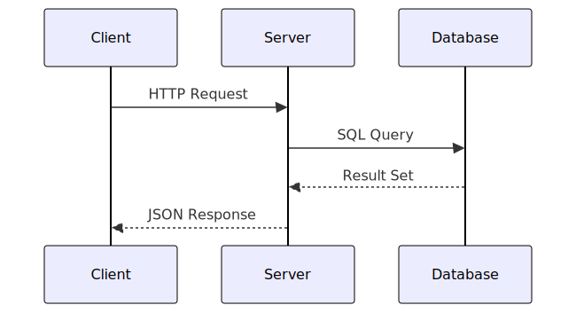
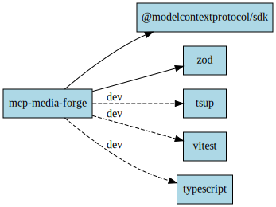
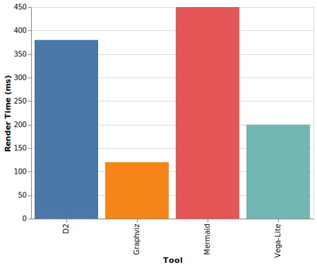

# MCP Media Forge

MCP server that generates diagrams, charts, and visual documentation from text DSLs -- designed for AI coding agents to embed into Markdown.

LLM agents call tools like `render_mermaid` or `render_d2` with text input, and get back file paths to SVG/PNG assets ready to embed in docs.

## Output Gallery

### Mermaid Flowchart


### Mermaid Sequence Diagram


### D2 Architecture Diagram


### Graphviz Dependency Graph


### Vega-Lite Bar Chart


## Tools

| Tool | Input | Formats | Use Case |
|------|-------|---------|----------|
| `render_mermaid` | Mermaid code | SVG, PNG | Flowcharts, sequence, ER, state, Gantt, git graphs |
| `render_d2` | D2 code | SVG, PNG | Architecture diagrams with containers and icons |
| `render_graphviz` | DOT code | SVG, PNG | Dependency graphs, network diagrams |
| `render_chart` | Vega-Lite JSON | SVG, PNG | Bar, line, scatter, area, heatmap charts |
| `list_assets` | -- | JSON | List all generated files |

## Quick Start

### 1. Start the rendering container

```bash
cd docker
docker compose up -d
```

### 2. Install and build the MCP server

```bash
npm install
npm run build
```

### 3. Register with Claude Code

Add to `~/.claude/settings.json`:

```json
{
  "mcpServers": {
    "media-forge": {
      "command": "node",
      "args": ["/path/to/mcp-media-forge/dist/index.js"],
      "env": {
        "PROJECT_ROOT": "/path/to/your/project"
      }
    }
  }
}
```

### 4. Use it

Ask Claude to generate a diagram:

> "Create a sequence diagram showing the OAuth2 flow and embed it in the README"

Claude will call `render_mermaid` with the diagram code, get back a file path, and embed it in your markdown.

## How It Works

```
Claude / AI Agent
    |
    | MCP Protocol (JSON-RPC over stdio)
    v
MCP Media Forge (Node.js on host)
    |
    | docker exec (sandboxed, no network)
    v
Rendering Container
  ├── mmdc       (Mermaid CLI + Chromium)
  ├── d2         (D2 diagrams)
  ├── dot/neato  (Graphviz)
  └── vl2svg     (Vega-Lite via vl-convert)
    |
    v
docs/generated/
  mermaid-a1b2c3.svg
  d2-7f8e9a.svg
  vegalite-d4e5f6.svg
```

**Key design decisions:**

- **Text in, file path out** -- returns relative paths, never base64 blobs
- **Content-hash naming** -- same input = same file = free caching + git-friendly
- **SVG preferred** -- vector format, small files, diffs cleanly in git
- **Docker-contained** -- all rendering tools run in a sandboxed container with `network_mode: none`
- **Structured errors** -- error responses include `error_type`, `error_message`, and `suggestion` to enable LLM self-correction

## Tool Reference

### render_mermaid

```json
{
  "code": "graph TD\n    A[Start] --> B{Decision}\n    B -->|Yes| C[Done]",
  "format": "svg",
  "theme": "default"
}
```

| Parameter | Type | Default | Description |
|-----------|------|---------|-------------|
| `code` | string | required | Mermaid diagram code |
| `format` | `svg` \| `png` | `svg` | Output format |
| `theme` | `default` \| `dark` \| `forest` \| `neutral` | `default` | Mermaid theme |

### render_d2

```json
{
  "code": "client -> server -> database",
  "format": "svg",
  "layout": "dagre"
}
```

| Parameter | Type | Default | Description |
|-----------|------|---------|-------------|
| `code` | string | required | D2 diagram code |
| `format` | `svg` \| `png` | `svg` | Output format |
| `theme` | number | -- | Theme ID (0=default, 1=neutral-grey, 3=terminal) |
| `layout` | `dagre` \| `elk` \| `tala` | `dagre` | Layout engine |

### render_graphviz

```json
{
  "dot_source": "digraph G { A -> B -> C }",
  "engine": "dot",
  "format": "svg"
}
```

| Parameter | Type | Default | Description |
|-----------|------|---------|-------------|
| `dot_source` | string | required | Graphviz DOT source code |
| `engine` | `dot` \| `neato` \| `fdp` \| `sfdp` \| `twopi` \| `circo` | `dot` | Layout engine |
| `format` | `svg` \| `png` | `svg` | Output format |

### render_chart

```json
{
  "spec_json": "{\"$schema\":\"https://vega.github.io/schema/vega-lite/v5.json\",\"data\":{\"values\":[{\"x\":1,\"y\":10}]},\"mark\":\"bar\",\"encoding\":{\"x\":{\"field\":\"x\"},\"y\":{\"field\":\"y\"}}}",
  "format": "svg"
}
```

| Parameter | Type | Default | Description |
|-----------|------|---------|-------------|
| `spec_json` | string | required | Vega-Lite JSON specification |
| `format` | `svg` \| `png` | `svg` | Output format |
| `scale` | number | 1 | Scale factor for PNG output |

### list_assets

```json
{
  "directory": ""
}
```

Returns a JSON array of all generated files with name, path, size, and modification time.

## Error Handling

All tools return structured errors that help LLMs self-correct:

```json
{
  "status": "error",
  "error_type": "syntax_error",
  "error_message": "Parse error on line 2: ...",
  "line": 2,
  "suggestion": "Check Mermaid syntax at https://mermaid.js.org/syntax/"
}
```

Error types: `syntax_error`, `rendering_error`, `dependency_missing`.

## Environment Variables

| Variable | Default | Description |
|----------|---------|-------------|
| `PROJECT_ROOT` | `cwd()` | Project root for output path resolution |
| `OUTPUT_DIR` | `docs/generated` | Output directory relative to PROJECT_ROOT |
| `MEDIA_FORGE_CONTAINER` | `media-forge-renderer` | Docker container name |

## Development

```bash
npm install
npm run build          # Build with tsup
npm run dev            # Watch mode
npm test               # Run all tests (37 total)
npm run test:unit      # Unit tests only (no Docker needed)
npm run test:component # Integration tests (requires Docker container)
npm run lint           # Type-check with tsc
```

### Running integration tests

```bash
cd docker && docker compose up -d   # Start renderer
cd .. && npm run test:component     # 26 tests across all 4 tools
```

## Examples

See [examples/](examples/) for sample input files:

| File | Tool | Description |
|------|------|-------------|
| [`mermaid/flowchart.mmd`](examples/mermaid/flowchart.mmd) | render_mermaid | Decision flowchart |
| [`mermaid/sequence.mmd`](examples/mermaid/sequence.mmd) | render_mermaid | Client-server sequence |
| [`d2/architecture.d2`](examples/d2/architecture.d2) | render_d2 | Backend architecture with containers |
| [`graphviz/dependencies.dot`](examples/graphviz/dependencies.dot) | render_graphviz | npm dependency graph |
| [`vegalite/bar-chart.json`](examples/vegalite/bar-chart.json) | render_chart | Tool performance comparison |

See [examples/README.md](examples/README.md) for MCP tool call examples and expected responses.

## License

[MIT](LICENSE)
