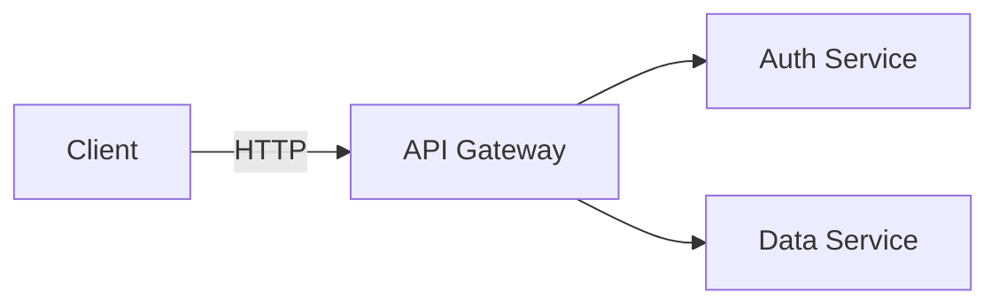

# Research: Embedding Rich Media in Markdown Documentation

*Last updated: 2026-02-18*

How to embed presentations, diagrams, videos, and animations into `.md` files across different platforms (GitHub, GitLab, MkDocs, Docusaurus, VS Code).

---

## 1. Platform Rendering Capabilities

### What GitHub Renders Natively

| Element | Supported | Notes |
|---|---|---|
| Images (PNG, JPG, SVG) | Yes | `` syntax |
| GIF | Yes | Inline, autoplays |
| Video (MP4, MOV) | Yes | Via `<video>` tag (added 2021) |
| Mermaid diagrams | Yes | Fenced code blocks (added 2022) |
| GeoJSON/TopoJSON | Yes | Interactive maps |
| STL 3D models | Yes | Interactive 3D viewer |
| Math (LaTeX) | Yes | `$inline$` and `$$block$$` (added 2022) |
| Inline HTML | Partial | Sanitized: no `<script>`, `<style>`, `<iframe>` |
| Inline SVG | Partial | Sanitized: no interactive/scripted SVG |
| Base64 data URIs | **No** | Stripped by sanitizer |
| Embedded iframes | **No** | Stripped |
| PlantUML | **No** | Needs pre-rendering |

### GitHub Alerts (Admonitions)

```markdown
> [!NOTE]
> Useful information.

> [!TIP]
> Helpful advice.

> [!IMPORTANT]
> Key information.

> [!WARNING]
> Urgent information requiring attention.

> [!CAUTION]
> Potential negative consequences.
```

---

## 2. Static Image Embedding

### Standard Syntax

```markdown


```

### Sizing and Alignment (HTML)

```markdown


<!-- Centered -->
<p align="center">
  
</p>

<!-- Side-by-side -->
<p>
  
  
</p>
```

### SVG vs PNG

- **SVG preferred**: vector, scales perfectly, small file size, diffs in git
- **PNG fallback**: when platform strips SVG features, or for raster content (screenshots)
- GitHub sanitizes SVG: no `<script>`, `<style>`, `<foreignObject>`, event handlers
- For full SVG fidelity, reference as `` tag (renders as image, no inline SVG issues)

---

## 3. Diagram Embedding

### Mermaid (Native GitHub/GitLab)

````markdown

````

**Limitations on GitHub**:
- Max ~50KB source
- No custom themes or CSS
- Some advanced features don't render (mindmap, some gitgraph)
- No click events

### Pre-rendered Diagrams (D2, Graphviz, PlantUML)

These don't render natively on GitHub. Pre-render to SVG/PNG and embed as images:

```markdown

```

### Dual Rendering Pattern

For docs that must work on both GitHub and a docs framework:

````markdown
<!-- Renders natively on GitHub -->


<!-- Fallback for platforms without Mermaid support -->
<!--  -->
````

### Kroki URL-Based Rendering

Kroki renders many diagram formats via URL:

```markdown


```

**Pros**: No build step. **Cons**: External dependency, URL-encoded source, GitHub CSP may block.

---

## 4. Video Embedding

### GIF — Universal (Recommended)

Works on every platform that renders markdown images:

```markdown


<!-- With sizing -->

```

**Creating GIFs**:
```bash
# From MP4 (inside container)
ffmpeg -i demo.mp4 -vf "fps=15,scale=800:-1" -gifflags +transdiff demo.gif

# From asciinema recording
agg demo.cast demo.gif --theme monokai

# From image sequence
ffmpeg -framerate 2 -i slide_%03d.png -vf "scale=800:-1" slides.gif
```

**Guidelines**: Keep under 5MB. Reduce framerate (10-15fps). Scale down dimensions.

### MP4 Video (GitHub)

GitHub renders `<video>` tags:

```markdown
<video src="./assets/demo.mp4" width="600" controls></video>

<!-- With poster -->
<video width="600" controls poster="./assets/poster.png">
  <source src="./assets/demo.mp4" type="video/mp4" />
</video>
```

**Note**: Works in GitHub repo markdown. Does not work on PyPI, npm, or most other registries.

### YouTube — Linked Thumbnail Pattern

Since GitHub strips iframes, use a clickable thumbnail:

```markdown
[](https://www.youtube.com/watch?v=VIDEO_ID)
```

### Asciinema — Terminal Recordings

```markdown
[](https://asciinema.org/a/CAST_ID)
```

Renders as clickable SVG preview linking to interactive player.

---

## 5. Presentation Embedding

### The Preview-Embed Pattern

Presentations can't render inline in markdown. Use a cover image linking to the full deck:

```markdown
[](./assets/slides/architecture.pdf)
```

Or with multiple slide thumbnails:

```markdown
## Architecture Presentation

| | | |
|---|---|---|
| [](./assets/slides/deck.pdf) | [](./assets/slides/deck.pdf#page=2) | [](./assets/slides/deck.pdf#page=3) |

[Download full presentation (PDF)](./assets/slides/deck.pdf)
```

### Google Slides (link only on GitHub)

```markdown
[View presentation](https://docs.google.com/presentation/d/SLIDE_ID/edit?usp=sharing)
```

In docs frameworks with HTML/iframe support:

```html
<iframe src="https://docs.google.com/presentation/d/SLIDE_ID/embed"
        width="960" height="569" frameborder="0" allowfullscreen></iframe>
```

---

## 6. Documentation Frameworks

### MkDocs Material — Best for Reference/API Docs

Supports: Mermaid (plugin), tabs, admonitions, lightbox zoom (glightbox), video (mkdocs-video plugin), math (KaTeX/MathJax).

```yaml
# mkdocs.yml
markdown_extensions:
  - pymdownx.superfences:
      custom_fences:
        - name: mermaid
          class: mermaid
          format: !!python/name:pymdownx.superfences.fence_code_format
  - pymdownx.tabbed:
      alternate_style: true
  - attr_list
  - md_in_html
plugins:
  - glightbox
  - mkdocs-video
```

### Docusaurus — Best for Product Docs with Interactivity

Supports: MDX (React components in markdown), Mermaid, tabs, iframes, live code playgrounds.

```javascript
// docusaurus.config.js
module.exports = {
  markdown: { mermaid: true },
  themes: ['@docusaurus/theme-mermaid'],
};
```

### Comparison

| Feature | MkDocs Material | Docusaurus | VitePress | Hugo |
|---|---|---|---|---|
| Mermaid | Plugin | Plugin | Plugin | Shortcode |
| Interactive components | Limited HTML | Full MDX/React | Full Vue | Shortcodes |
| Video embed | Plugin | MDX/HTML | HTML/Vue | Shortcode |
| Tabs | Native | Native | Native | Shortcode |
| Math/LaTeX | KaTeX/MathJax | KaTeX | MathJax | Plugin |
| Versioning | mike | Native | Manual | Manual |

---

## 7. Asset Storage Strategy

### In-Repo (small assets)

```
project/
  docs/
    generated/         # MCP-generated output (gitignored or committed)
      diagrams/        # SVG, PNG
      slides/          # PNG per slide, PDF
      animations/      # GIF
    assets/            # Hand-crafted assets
    architecture.md
```

**Guidelines**:
- SVG: commit directly (text-based, diffs)
- PNG/JPG: keep under 500KB, compress with `optipng`/`pngquant`
- GIF: keep under 5MB, reduce framerate and dimensions
- MP4: use Git LFS or external hosting

### Git LFS (large assets)

```gitattributes
*.mp4 filter=lfs diff=lfs merge=lfs -text
*.gif filter=lfs diff=lfs merge=lfs -text
docs/generated/videos/** filter=lfs diff=lfs merge=lfs -text
```

### GitHub Releases (very large files)

```markdown
[Full demo video (MP4, 45MB)](https://github.com/org/repo/releases/download/v1.0/demo.mp4)
```

Upload via: `gh release upload v1.0 ./assets/demo.mp4`

### Content-Addressable Naming

Prevent stale cache and enable deduplication:

```
docs/generated/{tool}-{sha256(input)[:12]}.{ext}
# e.g., docs/generated/mermaid-a1b2c3d4e5f6.svg
```

With a manifest file (`docs/generated/manifest.json`) mapping logical names to hashed filenames.

---

## 8. Recommended Patterns by Use Case

| Use Case | Approach | Works on GitHub |
|---|---|---|
| Architecture diagram | Mermaid fenced block OR pre-rendered D2 SVG | Yes |
| Data visualization | Pre-rendered Vega-Lite/ECharts PNG | Yes |
| CLI tool demo | Asciinema SVG link or converted GIF | Yes |
| Short UI demo (<30s) | GIF (compressed, <5MB) | Yes |
| Longer video (>30s) | MP4 via `<video>` tag or GitHub Releases link | Partial |
| YouTube tutorial | Linked thumbnail image | Yes (as link) |
| Presentation | Cover image linking to PDF | Yes |
| Math / equations | LaTeX `$...$` / `$$...$$` | Yes |
| Sequence diagram | Mermaid fenced block | Yes |
| Hand-drawn diagram | Excalidraw export as SVG | Yes |
