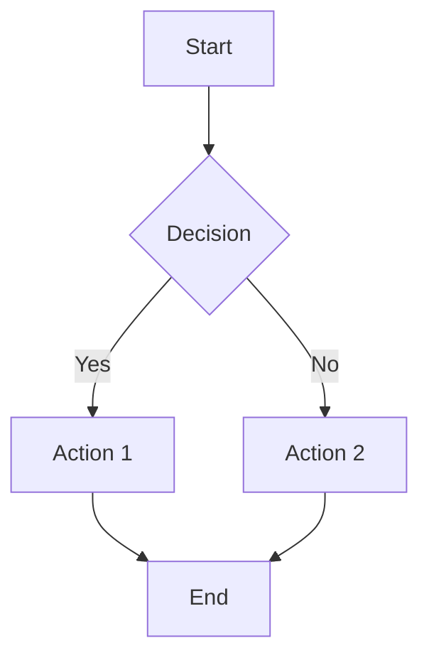
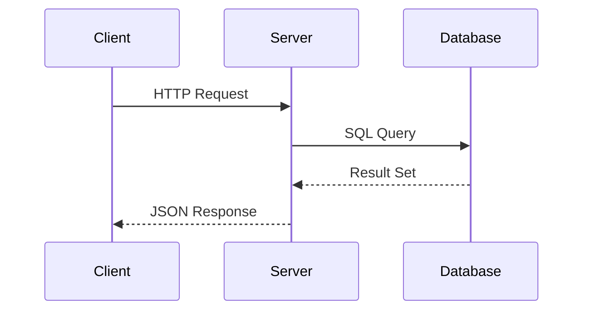
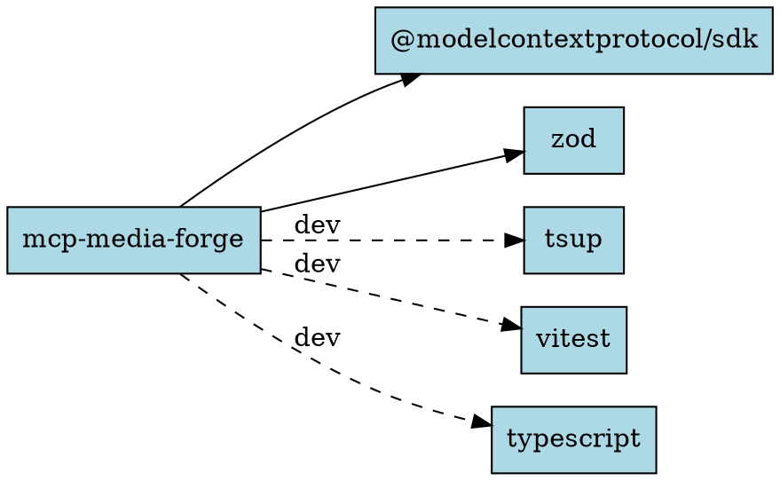

# Examples

Sample inputs for each tool with the expected MCP tool call and result.

## Mermaid — Flowchart

**Input** (`mermaid/flowchart.mmd`):


**MCP Tool Call**:
```json
{
  "tool": "render_mermaid",
  "arguments": {
    "code": "graph TD\n    A[Start] --> B{Decision}\n    B -->|Yes| C[Action 1]\n    B -->|No| D[Action 2]\n    C --> E[End]\n    D --> E",
    "format": "svg",
    "theme": "default"
  }
}
```

**Expected Result**:
```json
{
  "status": "completed",
  "output_path": "docs/generated/mermaid-<hash>.svg",
  "format": "svg",
  "size_bytes": 12480,
  "embed_markdown": ""
}
```

---

## Mermaid — Sequence Diagram

**Input** (`mermaid/sequence.mmd`):


**Expected**: SVG with 3 participants and 4 arrows.

---

## D2 — Architecture Diagram

**Input** (`d2/architecture.d2`):
```d2
direction: right

client: Client {
  browser: Browser
  mobile: Mobile App
}

server: Backend {
  api: API Gateway
  auth: Auth Service
  db: PostgreSQL
}

client.browser -> server.api: HTTPS
client.mobile -> server.api: HTTPS
server.api -> server.auth: Verify Token
server.api -> server.db: Query
```

**MCP Tool Call**:
```json
{
  "tool": "render_d2",
  "arguments": {
    "code": "direction: right\n\nclient: Client {\n  browser: Browser\n  mobile: Mobile App\n}\n\nserver: Backend {\n  api: API Gateway\n  auth: Auth Service\n  db: PostgreSQL\n}\n\nclient.browser -> server.api: HTTPS\nclient.mobile -> server.api: HTTPS\nserver.api -> server.auth: Verify Token\nserver.api -> server.db: Query",
    "format": "svg",
    "layout": "dagre"
  }
}
```

**Expected Result**:
```json
{
  "status": "completed",
  "output_path": "docs/generated/d2-<hash>.svg",
  "format": "svg",
  "size_bytes": 18200,
  "embed_markdown": ""
}
```

---

## Graphviz — Dependency Graph

**Input** (`graphviz/dependencies.dot`):


**MCP Tool Call**:
```json
{
  "tool": "render_graphviz",
  "arguments": {
    "dot_source": "digraph dependencies {\n    rankdir=LR;\n    node [shape=box, style=filled, fillcolor=lightblue];\n    \"mcp-media-forge\" -> \"@modelcontextprotocol/sdk\";\n    \"mcp-media-forge\" -> \"zod\";\n    \"mcp-media-forge\" -> \"tsup\" [style=dashed, label=\"dev\"];\n    \"mcp-media-forge\" -> \"vitest\" [style=dashed, label=\"dev\"];\n    \"mcp-media-forge\" -> \"typescript\" [style=dashed, label=\"dev\"];\n}",
    "engine": "dot",
    "format": "svg"
  }
}
```

**Expected Result**:
```json
{
  "status": "completed",
  "output_path": "docs/generated/graphviz-<hash>.svg",
  "format": "svg",
  "size_bytes": 8500,
  "embed_markdown": ""
}
```

---

## Vega-Lite — Bar Chart

**Input** (`vegalite/bar-chart.json`):
```json
{
  "$schema": "https://vega.github.io/schema/vega-lite/v5.json",
  "description": "Tool rendering performance",
  "data": {
    "values": [
      {"tool": "Mermaid", "time_ms": 450},
      {"tool": "D2", "time_ms": 380},
      {"tool": "Graphviz", "time_ms": 120},
      {"tool": "Vega-Lite", "time_ms": 200}
    ]
  },
  "mark": "bar",
  "encoding": {
    "x": {"field": "tool", "type": "nominal", "title": "Tool"},
    "y": {"field": "time_ms", "type": "quantitative", "title": "Render Time (ms)"},
    "color": {"field": "tool", "type": "nominal", "legend": null}
  },
  "width": 400,
  "height": 300
}
```

**MCP Tool Call**:
```json
{
  "tool": "render_chart",
  "arguments": {
    "spec_json": "{\"$schema\":\"https://vega.github.io/schema/vega-lite/v5.json\",\"description\":\"Tool rendering performance\",\"data\":{\"values\":[{\"tool\":\"Mermaid\",\"time_ms\":450},{\"tool\":\"D2\",\"time_ms\":380},{\"tool\":\"Graphviz\",\"time_ms\":120},{\"tool\":\"Vega-Lite\",\"time_ms\":200}]},\"mark\":\"bar\",\"encoding\":{\"x\":{\"field\":\"tool\",\"type\":\"nominal\",\"title\":\"Tool\"},\"y\":{\"field\":\"time_ms\",\"type\":\"quantitative\",\"title\":\"Render Time (ms)\"},\"color\":{\"field\":\"tool\",\"type\":\"nominal\",\"legend\":null}},\"width\":400,\"height\":300}",
    "format": "svg"
  }
}
```

**Expected Result**:
```json
{
  "status": "completed",
  "output_path": "docs/generated/vegalite-<hash>.svg",
  "format": "svg",
  "size_bytes": 6800,
  "embed_markdown": ""
}
```

---

## Error Examples

### Invalid Mermaid syntax
```json
{
  "tool": "render_mermaid",
  "arguments": {
    "code": "graph TD\n    A -> B"
  }
}
```

**Expected Error**:
```json
{
  "status": "error",
  "error_type": "syntax_error",
  "error_message": "Parse error on line 2: Expected '-->' but found '->'",
  "line": 2,
  "suggestion": "Check Mermaid syntax at https://mermaid.js.org/syntax/"
}
```

### Invalid Vega-Lite JSON
```json
{
  "tool": "render_chart",
  "arguments": {
    "spec_json": "not valid json"
  }
}
```

**Expected Error**:
```json
{
  "status": "error",
  "error_type": "syntax_error",
  "error_message": "Invalid JSON in Vega-Lite spec",
  "suggestion": "Validate your JSON and check the Vega-Lite schema at https://vega.github.io/vega-lite/"
}
```

### Container not running
```json
{
  "tool": "render_d2",
  "arguments": {
    "code": "a -> b"
  }
}
```

**Expected Error**:
```json
{
  "status": "error",
  "error_type": "dependency_missing",
  "error_message": "d2 not found in container",
  "suggestion": "Start the media-forge-renderer container: docker compose up -d"
}
```
